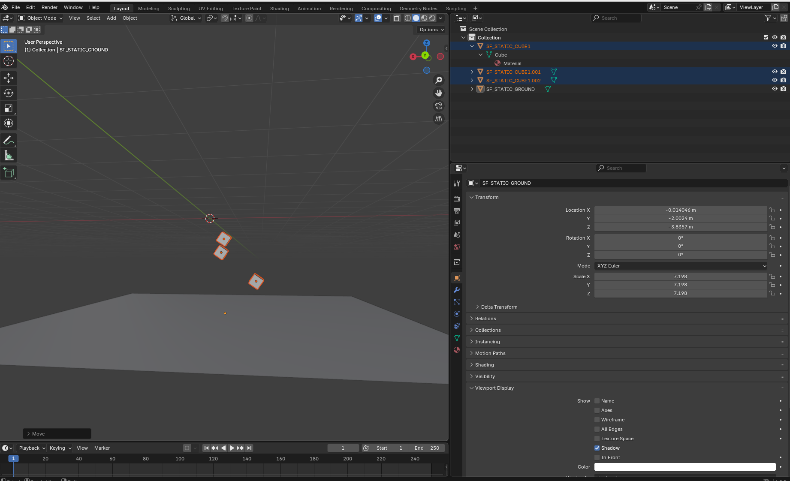

=================================
Blender–Stonefish Integration
=================================

We provide a Blender-to-Stonefish workflow to create, edit, and export simulation assets and AUV models.
This keeps scene authoring fast and reproducible while staying compatible with Stonefish Simulation.
