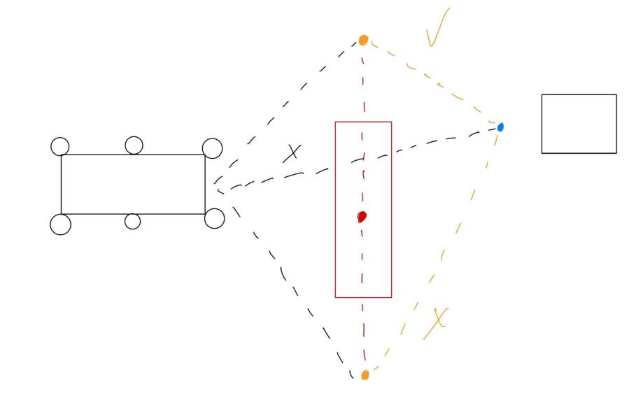

========================
Controllers and Planners
========================

Controllers and Planners is the set of mission logic, planning, and control components that drive the vehicle.
We emphasize simple, hackable building blocks that are easy to test in simulation and bring to real hardware.
