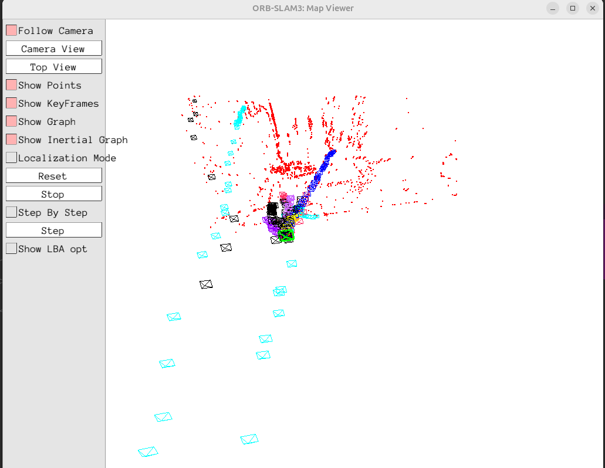
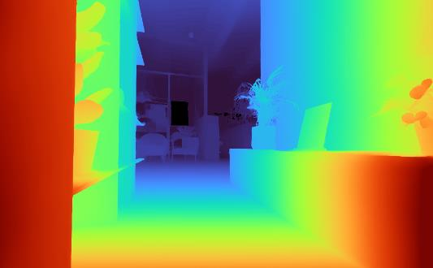

==========
Perception
==========

Perception is the stack of estimation and detection components that turns raw sensor data into useful state and measurements.
It combines visual odometry / SLAM, inertial fusion, and learned models where they add clear value.

