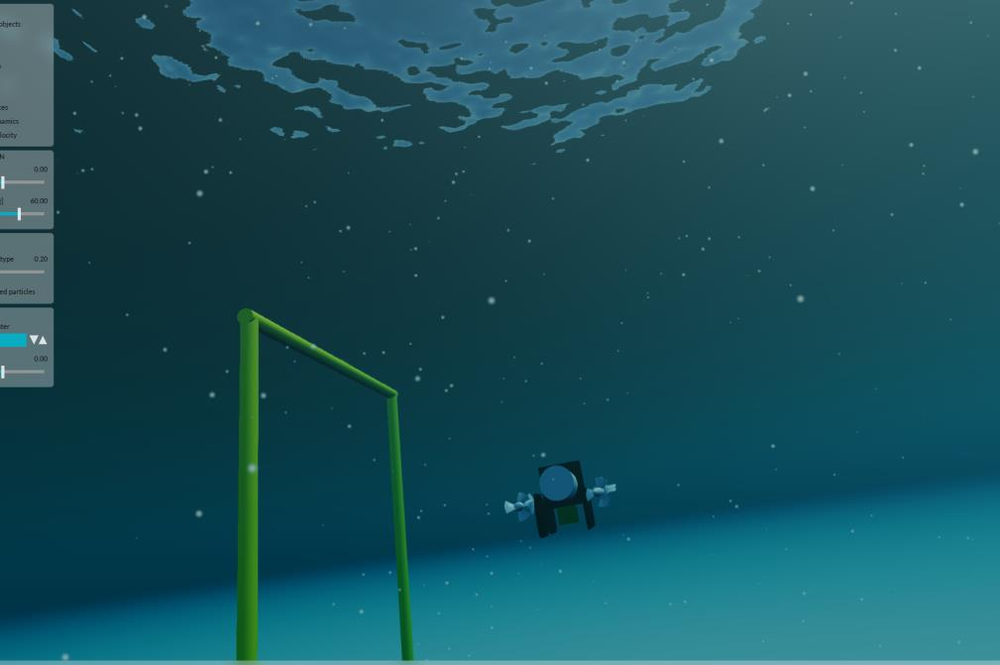

==============
Sim2Real Tools
==============

Sim2Real Tools is our collection of techniques and utilities to reduce the gap between simulation and the real world.
It focuses on practical workflows like domain randomization, calibration-aware testing, and repeatable evaluation.
